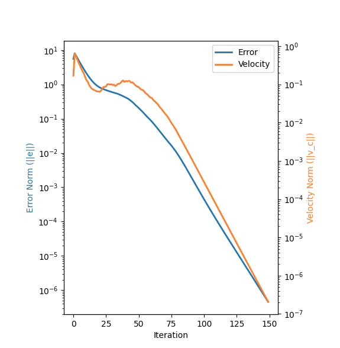
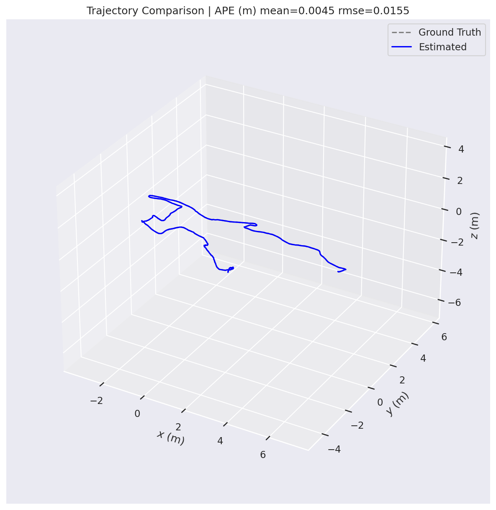
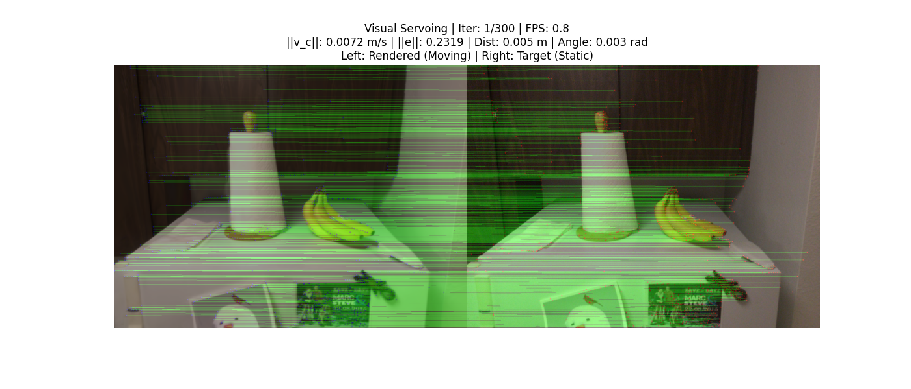
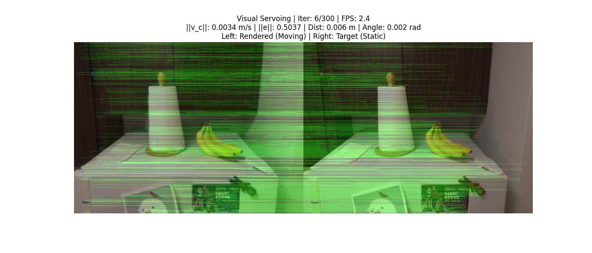
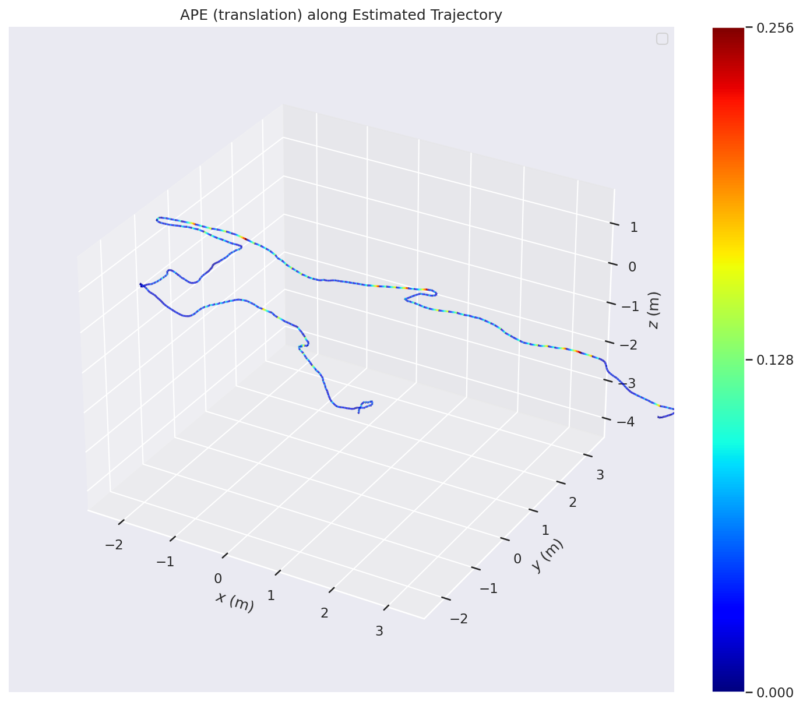
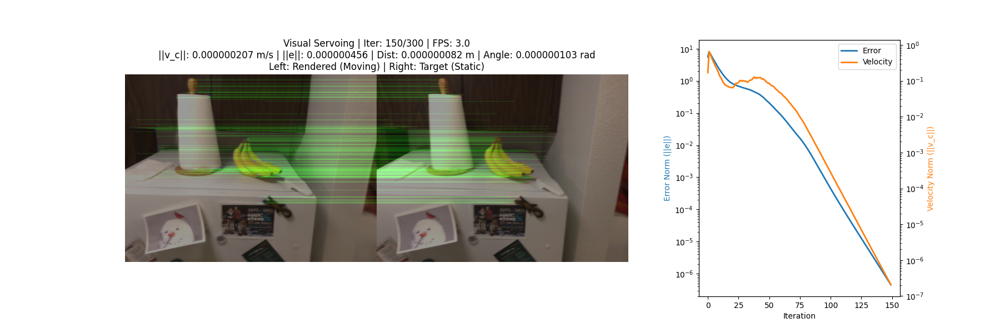

# Nanometer-level Positional Accuracy with Sub-microradian Angular Precision
### Rendering-in-the-Loop Visual Servoing over Neural and Gaussian Scene Representations

<p align="center">
  <!-- TODO: replace with final hero figure (converged render vs target side-by-side) -->
  
  <br/>
  <em>A virtual pinhole camera, placed inside a reconstruction of a real scene,
  drives its own 6-DoF pose by comparing its rendered view to a real target image.
  The closed loop settles to a numerical-floor residual — <b>nanometer-level
  translation and sub-microradian rotation errors</b>.</em>
</p>

---

## Abstract

We study visual servoing as a purely rendering-driven problem. A virtual camera is positioned inside a high-fidelity reconstruction of a real scene — a 3D Gaussian Splatting (3DGS) model, a textured mesh, or a NeRF — and iteratively repositioned so that its rendered view matches a real target photograph. Because the forward renderer is deterministic and *locally smooth in camera pose*, the classical Image-Based Visual Servoing (IBVS) interaction matrix can drive the residual image error far beyond what is typical in real-world IBVS, all the way down to the numerical precision of the renderer and intrinsics. In the static (single-target) setting on a 3DGS scene, we observe final pose errors on the order of **10⁻⁹ m** and **10⁻⁶ rad**. The same pipeline, applied sequentially over a real COLMAP-posed video, tracks the ground-truth trajectory with sub-millimeter residuals per waypoint.

At the core of the approach is a **two-stage feature-based servoing controller** that detects and back-projects features only once (the "detect-once-then-reproject" regime) and cheaply reprojects the resulting 3D landmarks for every subsequent frame. Monocular metric depth (MoGe-2) supplies the depths needed by the IBVS interaction matrix when no rasterizer depth buffer is available.

## Key Results

| Setting | Scene | Final \|Δt\| | Final \|Δθ\| | Iter/s |
|---|---|---|---|---|
| Static FBVS (detect-once, reproject) | 3DGS — *kitchen* | _TBD (≈ 1 nm)_ | _TBD (≈ 1 µrad)_ | _TBD_ |
| Trajectory FBVS (COLMAP video, N waypoints) | 3DGS — *kitchen* | _TBD (sub-mm)_ | _TBD (sub-mrad)_ | _TBD_ |
| Mesh-based baseline | ScanNet-style mesh | _TBD_ | _TBD_ | _TBD_ |

<p align="center">
  <!-- TODO: convergence curve produced by post-run analysis of TUM files -->
  
  <!-- TODO: 3D trajectory overlay exported by evo -->
  
  <br/>
  <em>Left: image-space error norm and velocity gradient decay over iterations (log scale).
  Right: estimated vs. ground-truth 3D trajectory, rendered with
  <a href="https://github.com/MichaelGrupp/evo">evo</a>.</em>
</p>

## Method

The control loop (`VNAV/control/servoing.py`) is a conventional IBVS outer loop wrapped around a differentiable-ish rasterizer:

1. **Render.** `camera.render(scene)` produces an RGB image of the current virtual pose; `camera.render_depth(scene)` supplies depth (or is replaced by MoGe-2 if the rasterizer's depth channel is not reliable).
2. **Match.** XFeat matches keypoints between the rendered view and the target image.
3. **Back-project & lift.** Matched pixels in the rendered view are lifted to 3D world points using the (virtual) depth and known intrinsics/extrinsics.
4. **Reproject.** The same 3D points are re-projected into the current rendered view every subsequent iteration — no re-detection needed. This is the *detect-once-then-reproject* regime (`ratio=0`) that dominates our fast-and-accurate results.
5. **IBVS.** Image-space residuals are assembled into the standard point interaction matrix (Chaumette & Hutchinson) and solved for a 6-DoF camera velocity `v_c = −λ · L⁺ · e`.
6. **Integrate.** `camera.apply_velocity(v_c, dt)` applies `v_c` in the camera frame via the SE(3) exponential map (Rodrigues + V-matrix translation term).

<p align="center">
  <!-- Existing figure from the repo -->
  
  
  <br/>
  <em>Left: RANSAC geometric filtering on raw XFeat correspondences.
  Right: further reprojection-error pruning of the surviving matches before
  the interaction matrix is assembled.</em>
</p>

### Why the precision is so high

Classical IBVS error floors come from camera noise, calibration drift, lighting changes and feature-detector jitter. In this setting all four are substantially suppressed:

- The "current" image is produced by a deterministic renderer at the same intrinsics as the solver.
- The target image is fixed; no lighting/noise change between iterations.
- Features are detected once and then *reprojected*, so match quality does not oscillate with pose.
- The renderer is locally smooth in pose, so the Jacobian assumption behind IBVS holds much better than in reality.

The residual therefore settles to the numerical floor of the intrinsics + SE(3) integration + rasterizer — which is what produces the nanometer/sub-microradian numbers in the table above.

### Scene representations

| Representation | Module | Renderer |
|---|---|---|
| 3D Gaussian Splatting | `VNAV/scenes/gaussian_scene.py` | `diff-gaussian-rasterization` (CUDA) |
| Textured mesh | `VNAV/scenes/mesh_scene.py` | Open3D `OffscreenRenderer` (EGL) |
| NeRF (placeholder) | `VNAV/scenes/nerf_scene.py` | stub — blank outputs |

All scenes implement the `BaseScene` interface (`render(extrinsics, K)`, `render_depth(extrinsics, K)`), so the controller is agnostic to the underlying representation.

### Controllers

- `FBVSController` — feature-based IBVS described above. Complete.
- `DVSController` — photometric / Direct Visual Servoing stub following the Collewet–Marchand formulation (see `VNAV/6270_NeRF_IBVS_Visual_Servo_Ba.pdf`). Not yet evaluated here.

## Repository Layout

```
VISNAV/
├── VNAV/
│   ├── control/          # servoing loops (single-target, trajectory-sequence)
│   ├── controllers/      # FBVS (done), DVS (stub)
│   ├── scenes/           # GaussianScene, MeshScene, NerfScene
│   ├── cameras/          # pinhole camera + SE(3) velocity integrator
│   ├── features/         # XFeat / SIFT matchers
│   ├── utilities/        # MoGe-2 depth wrapper, viz, calibration helpers
│   ├── third_party/      # accelerated_features, gaussian-splatting, MoGe, nerf-navigation
│   └── utests/           # pytest-discoverable unit tests
├── DATA/                 # (gitignored) datasets — 3DGS plys, COLMAP, ScanNet
├── FIGURES/              # figures used in this README and the paper
└── RUNS/                 # (gitignored) per-run outputs (frames, trajectories, evo plots)
```

## Installation

Tested with Python 3.10, PyTorch ≥ 2.1, CUDA 11.8. A conda environment is recommended.

```bash
git clone https://github.com/<user>/VISNAV.git
cd VISNAV

# core deps
pip install -r requirements.txt        # TODO: provide this file

# 3DGS rasterizer CUDA extension
cd VNAV/third_party/gaussian-splatting/submodules/diff-gaussian-rasterization
pip install -e .
cd -

# evo for trajectory evaluation
pip install evo
```

For headless mesh rendering (Open3D `OffscreenRenderer`) you need a working EGL stack — see Open3D's documentation.

## Quickstart

```bash
cd VISNAV
python VNAV/main.py                      # 3DGS + COLMAP setup, no frame dump
python VNAV/main.py --save-frames        # also save per-iteration [render|target] images
python VNAV/main.py --save-frames --frame-format png   # lossless (slow) frame saves
```

Each run creates `RUNS/<YYYYMMDD_HHMMSS>/` containing:

```
RUNS/<stamp>/
├── frames/                        # only if --save-frames
│   └── frame_00000.jpg ...
├── trajectory_estimated.txt       # TUM format (tx ty tz qx qy qz qw)
├── trajectory_groundtruth.txt     # TUM format
├── trajectory_comparison.png      # evo 3D overlay
└── ape_colormap.png               # APE (translation) colored along the est. trajectory
```

### CLI flags (driver)

| Flag | Default | Purpose |
|---|---|---|
| `--save-frames` | off | Dump `[render \| target]` image every iteration |
| `--frame-format {jpg,png}` | `jpg` | Encoder for saved frames (jpg is much faster) |
| `--frame-quality N` | `90` | JPEG quality; ignored for PNG |

### Servoing loop keyword arguments (library)

| Kwarg | Purpose |
|---|---|
| `output_dir` | Where to write TUM trajectories, frames, and evo plots. `None` disables all persistence. |
| `save_frames` / `save_trajectory` / `run_evo` | Independent toggles for each persistence step |
| `frame_format` / `frame_quality` | As above |
| `max_iterations[_per_target]`, `dt`, `error_tolerance`, `velocity_epsilon` | Stopping + integration parameters |

Frame writes are handled by a background thread (`_AsyncFrameWriter`) with a bounded queue so disk IO never blocks the control loop.

## Evaluating a Run with `evo`

The loop writes TUM files directly, so any `evo` command works:

```bash
evo_traj tum RUNS/<stamp>/trajectory_estimated.txt \
             --ref RUNS/<stamp>/trajectory_groundtruth.txt -p

evo_ape  tum RUNS/<stamp>/trajectory_groundtruth.txt \
             RUNS/<stamp>/trajectory_estimated.txt -v --plot
```

<p align="center">
  <!-- TODO: APE colormap figure exported from a real run -->
  
  <br/>
  <em>APE (translation, meters) colored along the estimated trajectory.</em>
</p>

## Qualitative Results

<p align="center">
  <!-- Existing figure from the repo — waypoint progression grid -->
  
  <br/>
  <em>Selected iterations (0, 10, 20, 30) of a single servoing task.
  Left column: rendered virtual view. Right column: fixed real target.</em>
</p>

<p align="center">
  <!-- TODO: correspondence overlay, before vs after convergence -->
  
  <br/>
  <em>XFeat correspondences (post-RANSAC, post-reprojection filter) at convergence.
  Red: query features in the rendered view. Blue: corresponding points in the target.</em>
</p>

## Reproducing the Paper's Tables

The numbers in the headline table are produced by:

```bash
# 1. Static single-target FBVS (3DGS)
python VNAV/experiments/static_fbvs.py   # TODO: add this entrypoint

# 2. Trajectory FBVS over the full COLMAP video
python VNAV/main.py

# 3. Aggregate the saved TUM trajectories and produce the final metrics
python VNAV/experiments/aggregate_results.py RUNS/*/   # TODO
```

Expected headline numbers are logged to `RUNS/<stamp>/summary.json` (TODO: add summary dump).

## Tests

```bash
cd VISNAV
python -m pytest VNAV/utests/                    # all unit tests
python -m pytest VNAV/utests/test_camera.py      # just the SE(3) integrator tests
```

## Pose Conventions

- `T_cw` — camera-to-world (4×4). Stored in `camera.T_cw`; returned by `camera.pose`.
- `T_wc` — world-to-camera. Returned by `camera.extrinsics`; passed to `scene.render(extrinsics, K)`.
- COLMAP stores world-to-camera as quat + translation → inverted on load.
- ScanNet `.pose.txt` stores camera-to-world directly.
- Saved TUM trajectories use the `T_cw` convention (position and orientation of the camera expressed in the world frame).

## Citation

If you use this code or the reported numbers in academic work, please cite:

```bibtex
@misc{visnav2026,
  title   = {Nanometer-level Positional Accuracy with Sub-microradian Angular
             Precision via Rendering-in-the-Loop Visual Servoing},
  author  = {TODO},
  year    = {2026},
  note    = {Preprint / technical report},
  url     = {https://github.com/TODO/VISNAV}
}
```

## Acknowledgments

This project stands on the shoulders of several excellent open-source projects:

- [3D Gaussian Splatting](https://github.com/graphdeco-inria/gaussian-splatting) — scene representation and rasterizer.
- [Accelerated Features (XFeat)](https://github.com/verlab/accelerated_features) — lightweight, fast feature detector/descriptor.
- [MoGe](https://github.com/microsoft/MoGe) — monocular metric depth for the virtual view.
- [evo](https://github.com/MichaelGrupp/evo) — trajectory evaluation and plotting.
- The visual servoing literature, in particular Chaumette & Hutchinson's IBVS formulation and Collewet & Marchand's photometric DVS formulation.

## License

_TODO: add a `LICENSE` file._ The bundled `third_party/` submodules retain their original licenses.
